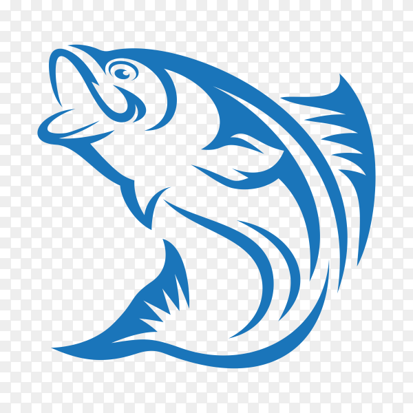

<div align="center">

  
  <br/>

  <h1><b>Seafood Capstone</b></h1>

</div>

# 📗 Table of Contents

- [📖 About the Project](#about-project)
  - [🛠 Built With](#built-with)
    - [Tech Stack](#tech-stack)
    - [Key Features](#key-features)
  - [🚀 Live Demo](#live-demo)
- [💻 Getting Started](#getting-started)
  - [Setup](#setup)
  - [Prerequisites](#prerequisites)
  - [Install](#install)
  - [Usage](#usage)
  - [Run tests](#run-tests)
  - [Deployment](#triangular_flag_on_post-deployment)
- [👥 Authors](#authors)
- [🔭 Future Features](#future-features)
- [🤝 Contributing](#contributing)
- [⭐️ Show your support](#support)
- [🙏 Acknowledgements](#acknowledgements)
- [📝 License](#license)

## About the Project

> This project is a capstone project for Microverse, where you can see meals that we got from the API, on this website you are able to like the meals, comment the meals, and add reservation for the meals.

## Built With

- HTML
- CSS
- JavaScript
- Webpack
- Jest
- API

### Key Features

- Getting meal cards from the API
- Liking the meals with the counter
- Adding comments on it
- Adding reservations for the meals

## Live Demo

[Live Demo](https://zeff96.github.io/Seafood-capstone-project/dist/)

## Getting Started

### Setup

Clone this repository to your desired folder:

```sh
  cd your-prefer-folder
  git clone https://github.com/zeff96/Seafood-capstone-project
```

### Run this command to install dependencies

> npm install

### Run this command to build your webpack

> npm run build

### Run this command to run server

> npm start

### Run this command to run test

> npm run test

## 👥 Authors <a name="authors"></a>

👤 **Enis Memic**

- GitHub: [@enis-memic](https://github.com/enis-memic)
- LinkedIn: [enis-memic](https://linkedin.com/in/enis-memic)

👤 **Adeka Zeffs**

- GitHub: [zeff96](https://github.com/zeff96)
- LinkedIn: [zeffo96](https://www.linkedin.com/in/zeff-adeka-28060820a/)

👤 **Shubham Bhoyar**

- GitHub: [@shubhambhoyar077](https://github.com/shubhambhoyar077)

## 🔭 Future Features

- Responsiveness

## 🤝 Contributing <a name="contributing"></a>

Contributions, issues, and feature requests are welcome!

Feel free to check the [issues page](https://github.com/zeff96/Seafood-capstone-project/issues).

## Show your support

Give a ⭐️ if you like this project!

## 🙏 Acknowledgments

I would like to thank Microverse!

## 📝 License

This project is [MIT](./MIT.md) licensed.
